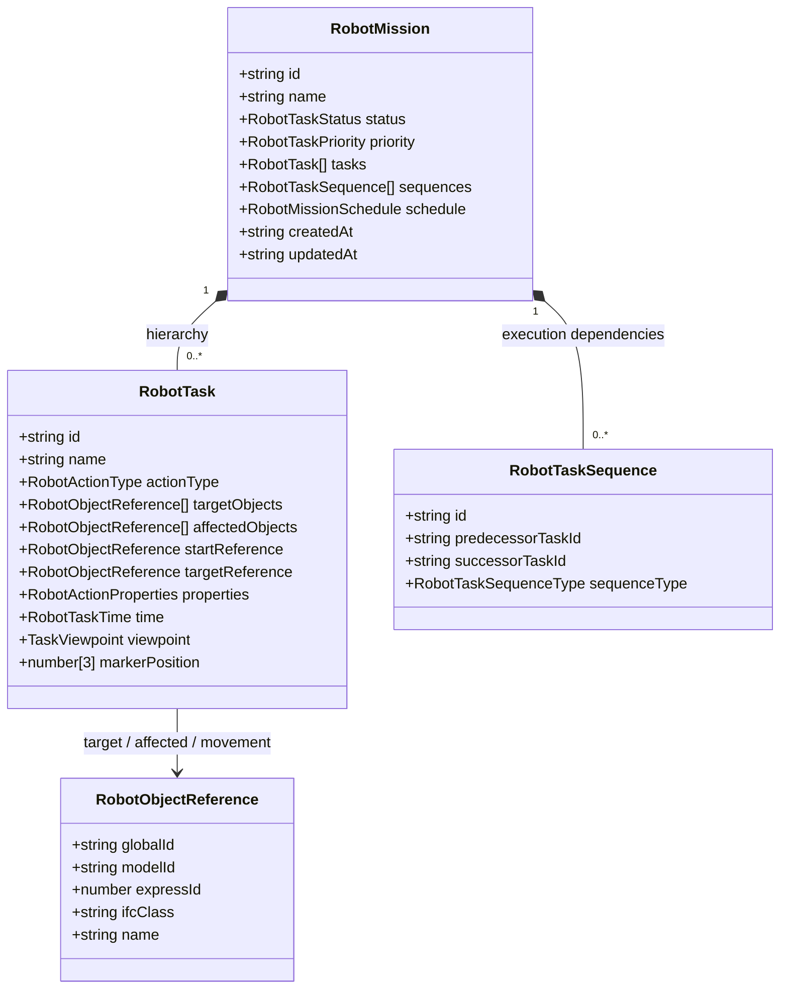
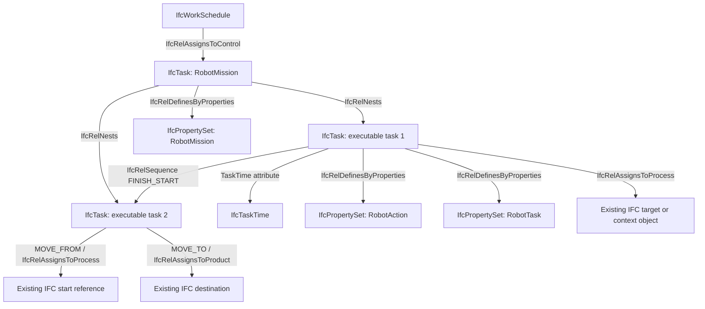
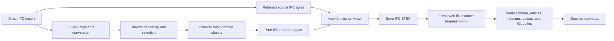
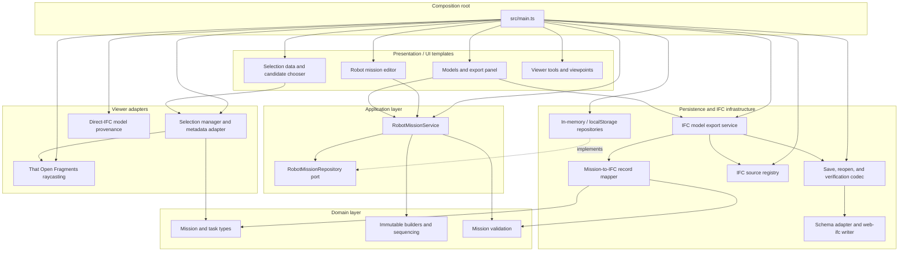

# IM PVS IFC Viewer

Browser-based IFC and Fragments viewer for annotating building elements with structured robot missions. The project is a proof of concept developed in the context of a master's thesis. It combines performant BIM visualization with a domain model for robot tasks and a schema-aware IFC-STEP export.

The central modeling decision is:

> IFC provides the structural entities and relations. Concrete robotics action semantics are stored as custom properties on `IfcTask`.

A mission is therefore not stored as an ad-hoc property on a door or wall. It becomes a parent `IfcTask`, its executable steps become child `IfcTask` entities, and the referenced building objects retain their original IFC identity.

## Project status and scope

The repository implements an end-to-end proof of concept for:

- loading IFC and Fragments models in a browser;
- rendering large models through That Open Fragments;
- inspecting and selecting IFC objects, including overlapping geometry;
- authoring robot missions and ordered executable tasks;
- persisting the internal mission model in memory or browser `localStorage`;
- validating task semantics and dependency graphs;
- mapping missions to IFC entities and relations;
- writing missions into source-backed IFC4/IFC4X3 STEP files;
- reopening and verifying the generated IFC before it is downloaded.

This is not a general-purpose IFC editor or robot control system. Path planning, physical robot execution, multi-user synchronization, backend persistence, arbitrary `.frag`-to-IFC reconstruction, and a lossless IFC round trip for structural model edits are outside the current PoC.

## Technology stack

| Area                                  | Technology                                           |
| ------------------------------------- | ---------------------------------------------------- |
| Language and build                    | TypeScript, Vite, Node.js/npm                        |
| 3D rendering                          | Three.js                                             |
| BIM components                        | `@thatopen/components`, `@thatopen/components-front` |
| High-performance model representation | `@thatopen/fragments`                                |
| IFC parsing and STEP writing          | `web-ifc`                                            |
| UI                                    | `@thatopen/ui`, `@thatopen/ui-obc`                   |
| Tests                                 | Node.js test runner, bundled with esbuild            |

## Quick start

### Requirements

- Node.js LTS
- npm
- a current Chrome or Edge browser

### Install and run

```bash
npm install
npm run dev
```

Vite normally serves the application at `http://localhost:5173` and prints the exact URL in the terminal.

### Production build

```bash
npm run build
npm run preview
```

## IFC models used for annotation

The repository contains two IFC4 reference models in [`IFC/`](IFC/):

| File                                       | Approximate size | Source model indicated by the IFC header        | Intended use                            |
| ------------------------------------------ | ---------------: | ----------------------------------------------- | --------------------------------------- |
| [`01_Haus.ifc`](IFC/01_Haus.ifc)           |         2.45 MiB | FZK-Haus / Archicad 20                          | Smaller residential test model          |
| [`03_Institute.ifc`](IFC/03_Institute.ifc) |        10.43 MiB | Institute/office building variant / Archicad 20 | Larger performance and annotation model |

Both files declare `FILE_SCHEMA(('IFC4'))`, which is supported by the mission writer.

The application does not hard-code either file. Use **Models → Add → IFC** and choose the desired model from the local filesystem. Any directly imported, supported IFC can be annotated. The bundled files are reproducible examples for development and evaluation.

When an IFC is imported:

1. `web-ifc` parses the source IFC.
2. That Open converts it to a Fragments model for browser rendering.
3. The original IFC bytes and file name are retained in an in-memory source registry.
4. Robot tasks refer to selected IFC objects primarily by `GlobalId`.
5. Export reopens the retained IFC source and adds the mission entities.

An imported `.frag` file can be viewed, but it has no retained IFC source and therefore cannot currently be exported as a trustworthy IFC file.

## GUI features

The main layout contains the model panel, 3D viewport, selection data, robot mission editor, and viewpoint panel.

### Model loading and export

- Load local `.ifc` files and convert them to Fragments for rendering.
- Load existing `.frag` files directly.
- Display and search loaded models.
- Select a source-backed IFC model as the export target.
- Export the model with every mission in the currently active mission store.
- Report unsupported sources, structural edits, invalid missions, and unresolved object references instead of producing a misleading file.

### 3D viewer

- Orbit, pan, zoom, and focus the camera.
- Switch between perspective and orthographic projection.
- Toggle the world grid.
- Ambient occlusion, edge rendering, and Fragments level-of-detail materials.
- Show all, hide selected, or isolate selected components.
- Toggle a transparent “ghost” representation of the model.
- Apply persistent highlight colors to selected components.
- Create clipping sections.
- Measure length and area.

Selection is paused while measurement or clipping tools are active so tool input cannot accidentally change a robot-task target.

### IFC object selection

The selection workflow is designed for dense BIM geometry where several objects may lie under the same cursor position:

- worker-backed raycasts query all loaded Fragments models;
- hits are ordered by distance and deduplicated;
- clipped and optionally hidden objects are excluded;
- IFC metadata is resolved in batches;
- overlapping candidates can be previewed, cycled, and explicitly confirmed;
- keyboard controls support arrow keys, Enter, and Escape;
- filters can show visible objects only and exclude `IfcSpace` or opening elements;
- hover, candidate, and confirmed-selection highlights use separate styles;
- late asynchronous raycast results cannot overwrite a newer selection.

The confirmed selection is converted to a domain-level `RobotObjectReference`. A durable IFC `GlobalId` is preferred. A model-scoped `expressId` is accepted only as a fallback when it can be associated with the correct source model.

### Selection data

- Show the selected element's IFC properties in a structured table.
- Search and expand property rows.
- Display selection metadata such as IFC class, `GlobalId`, `expressId`, name, and hit distance.
- Export displayed property data as TSV.

### Robot mission editor

- Select the active storage mode.
- Create, select, and delete complete missions.
- Add and delete executable tasks.
- Choose one of the supported action types.
- Assign the confirmed IFC object as a target, affected object, MOVE start, or MOVE destination.
- Edit schedule start, finish, duration, and completion.
- Move tasks up or down; the UI regenerates a linear `FINISH_START` dependency chain.
- Show mission-level and task-level validation feedback.
- Save incomplete authoring drafts while preventing invalid missions from being exported.

The domain supports additional fields such as task descriptions, status, priority, action preconditions/postconditions, viewpoints, and marker positions. Not all of those fields currently have dedicated controls in the mission panel, but they are available through the TypeScript application service and are preserved by persistence and IFC mapping.

### Viewpoints

- Create a viewpoint from the current camera.
- Include the confirmed selection and persistent component colors.
- Use the selected object's name as the viewpoint title when available.
- List the created viewpoints through the That Open viewpoint table.

The standalone viewpoint panel and the optional `RobotTask.viewpoint` annotation field are currently separate concepts; automatic attachment of a newly created viewer viewpoint to a task is a future UI enhancement.

## Typical annotation workflow

1. Start the application and import an IFC file through the Models panel.
2. Choose **No storage** for a temporary draft or **Local storage** for browser persistence.
3. Create a mission.
4. Add an executable task such as `OPEN` or `NAVIGATE_TO`.
5. Click an IFC object in the viewer.
6. If several objects overlap, select and confirm the intended candidate.
7. Assign the confirmed object to the task in the correct semantic role.
8. Add further tasks and arrange their execution order.
9. Resolve every blocking validation issue.
10. Select the source-backed model and press **Export IFC**.

The downloaded `<source-name>-export.ifc` contains the original building model plus the generated mission structure.

## Robot mission domain model

The internal TypeScript model is the application's source of truth. It is intentionally independent of Three.js, Fragments IDs, browser storage, and STEP syntax.



### Mission

A `RobotMission` is an aggregate root containing:

- a stable ID, name, optional description, status, and priority;
- executable child tasks;
- explicit sequence relations between those tasks;
- optional mission schedule metadata;
- creation and modification timestamps.

The order of `tasks` represents hierarchy/display order. Execution dependencies are stored separately in `sequences`. This prevents task nesting from being incorrectly interpreted as temporal order.

### Task

A `RobotTask` contains the executable semantics:

- `actionType`;
- direct targets and indirectly affected objects;
- MOVE start and destination references;
- status and priority;
- direct task timing;
- task-owned robot action properties;
- optional viewpoint and marker annotation data;
- audit timestamps.

Supported action values are:

```text
OPEN
CLOSE
SWITCH_ON
SWITCH_OFF
MOVE
PASS_THROUGH
NAVIGATE_TO
```

These are project-specific robotics values, not native IFC enums.

### Object identity

`RobotObjectReference` keeps the domain coupled to IFC identity rather than rendering identity:

- `GlobalId` is the preferred persistent reference;
- `modelId + expressId` is a model-local fallback;
- `ifcClass` and `name` provide validation and presentation metadata;
- action semantics are never copied onto the referenced building object.

This allows the same door to be referenced by one `OPEN` task and a later `CLOSE` task without changing the door's static properties.

### Validation

Validation reports blocking errors and non-blocking warnings. Important rules include:

- mission and task IDs/names are required;
- a mission intended for execution/export needs at least one task;
- each task needs a supported `actionType`;
- object-oriented actions need a target or suitable reference;
- `OPEN`/`CLOSE` should reference a door-like object;
- `SWITCH_ON`/`SWITCH_OFF` should reference a switch-like object;
- MOVE requires both a start and destination;
- sequence endpoints must exist;
- a task cannot depend on itself;
- dependency graphs must be acyclic;
- completion must be between `0` and `1`;
- concrete RobotAction data must be attached to the task, not an IFC object reference.

When IFC type metadata is unavailable, type plausibility is reported as a warning rather than automatically invalidating an otherwise usable task.

## Resulting IFC mission model

The pure mapper first converts a valid domain mission into typed, IFC-like records. A separate writer resolves those records into schema-specific `web-ifc` entities. This separation keeps domain rules testable without loading WASM or mutating an IFC file.



### Mapping overview

| Internal concept         | IFC result                                              |
| ------------------------ | ------------------------------------------------------- |
| Mission                  | Parent `IfcTask`, `ObjectType = RobotMission`           |
| Executable step          | Child `IfcTask`, `ObjectType = RobotTask`               |
| Mission hierarchy        | `IfcRelNests`                                           |
| Task dependency          | `IfcRelSequence`                                        |
| Task timing              | Direct `IfcTask.TaskTime → IfcTaskTime`                 |
| Mission plan             | `IfcWorkSchedule` + `IfcRelAssignsToControl`            |
| Direct interaction       | `IfcRelAssignsToProcess`, usually `OPERATES_ON`         |
| Indirect effect          | `IfcRelAssignsToProcess`, `AFFECTS`                     |
| Passage/navigation       | `PASSES_THROUGH` or `NAVIGATES_TO` relation name        |
| MOVE origin              | `IfcRelAssignsToProcess`, `MOVE_FROM`                   |
| MOVE destination         | `IfcRelAssignsToProduct`, `MOVE_TO`                     |
| Concrete action          | Task-owned `IfcPropertySet` named `RobotAction`         |
| Task annotation metadata | Task-owned `IfcPropertySet` named `RobotTask`           |
| Mission audit metadata   | Parent-task-owned `IfcPropertySet` named `RobotMission` |

`RobotAction` contains `ActionType` and optional values such as `TargetState`, `RequiredCapability`, `Preconditions`, `Postconditions`, and `SuccessCondition`. The custom property-set names intentionally do not use the reserved `Pset_` prefix.

Status is written to `IfcTask.Status`; domain priorities map from `low`, `medium`, `high`, and `critical` to IFC integer priorities `1` through `4`. `RobotTask` preserves task creation/update times plus optional camera and marker coordinates, while `RobotMission` preserves mission creation/update times. A work schedule is generated for every mission; when explicit schedule metadata is absent, its identity/name and start time are derived from the mission.

New `IfcRoot` entities receive new IFC GlobalIds. Existing target objects are resolved against the selected source IFC by `GlobalId`, with a source-model-scoped `expressId` fallback. References that are missing, ambiguous, or incompatible with the required IFC select type stop the export.

## IFC export pipeline



The exporter currently supports `IFC4`, `IFC4X3`, `IFC4X3_ADD1`, and `IFC4X3_ADD2`. `IFC2X3` is rejected because the mission writer does not perform a schema conversion.

Export safety rules:

- only models with a retained direct IFC source are exportable;
- arbitrary `.frag` files are view-only for IFC export purposes;
- structural Fragments edits mark the source-backed model as unsafe to export;
- every current mission must pass domain validation;
- every referenced object must resolve in the selected source IFC;
- the saved output must reopen with the same schema;
- every generated mission entity and relationship is verified after reopening.

## Storage concept

Mission persistence is separated from model rendering and IFC export through a `RobotMissionRepository` port.

| Mode          | Implementation                       | Lifetime               | Behavior                                          |
| ------------- | ------------------------------------ | ---------------------- | ------------------------------------------------- |
| No storage    | `InMemoryRobotMissionRepository`     | Current page session   | Default; data disappears on reload                |
| Local storage | `LocalStorageRobotMissionRepository` | Browser profile/origin | Explicit opt-in; stores a versioned JSON envelope |
| Backend       | Reserved adapter slot                | Not implemented        | Visible but disabled/unavailable                  |

The local-storage key is:

```text
ifc-viewer:robot-missions:domain-v1
```

Stored shape:

```json
{
  "version": 1,
  "missions": []
}
```

Important storage properties:

- the complete mission aggregate is saved atomically;
- every application-service mutation persists through the active repository;
- stored data is structurally checked before use;
- corrupt JSON or unsupported versions are rejected without being overwritten;
- legacy keys are not read, migrated, or deleted;
- switching storage modes does not copy, merge, or remove missions;
- IFC source bytes remain session-only in the separate `IfcSourceModelRegistry`;
- export reads missions only from the currently active storage mode.

## Architecture

The project follows a layered, ports-and-adapters-oriented design. Dependencies point toward the domain model; viewer libraries, browser storage, and IFC writing stay at the edges.



### Layer responsibilities

| Layer            | Main locations                                                 | Responsibility                                                                                   |
| ---------------- | -------------------------------------------------------------- | ------------------------------------------------------------------------------------------------ |
| Composition root | [`src/main.ts`](src/main.ts)                                   | Creates That Open components, services, repositories, selection adapters, and UI state           |
| Domain           | [`src/domain/robot-tasks/`](src/domain/robot-tasks/)           | Framework-independent types, immutable builders, sequencing, and validation                      |
| Application      | [`src/application/robot-tasks/`](src/application/robot-tasks/) | Mission use cases and persistence port                                                           |
| Persistence      | [`src/persistence/robot-tasks/`](src/persistence/robot-tasks/) | In-memory, `localStorage`, and selectable repository adapters                                    |
| Viewer adapters  | [`src/viewer/robot-tasks/`](src/viewer/robot-tasks/)           | Fragments selection, metadata resolution, stable IFC reference conversion, highlights            |
| IFC mapping      | [`src/ifc/robot-tasks/`](src/ifc/robot-tasks/)                 | Pure domain-to-IFC record graph                                                                  |
| IFC export       | [`src/ifc/model-export/`](src/ifc/model-export/)               | Source registry, schema selection, STEP writing, and independent verification                    |
| UI               | [`src/ui-templates/`](src/ui-templates/)                       | Model, selection, mission, viewpoint, and viewer-tool components                                 |
| Tests            | [`test/robot-tasks/`](test/robot-tasks/)                       | Domain, application, persistence, selection, mapping, writer, and real web-ifc integration tests |

## Programmatic mission example

The UI uses the same application service shown below. Each command saves the complete changed mission through the chosen repository. Replace the example IFC GlobalId with an object from the imported source model.

```ts
import { RobotMissionService } from "./src/application/robot-tasks";
import { LocalStorageRobotMissionRepository } from "./src/persistence/robot-tasks";
import {
  IfcModelExportService,
  IfcSourceModelRegistry,
  WebIfcStructuralCodec,
} from "./src/ifc/model-export";

const repository = new LocalStorageRobotMissionRepository(window.localStorage);
const missions = new RobotMissionService(repository);

const missionId = "entrance-mission";
const door = {
  globalId: "REPLACE_WITH_SOURCE_IFC_GLOBAL_ID",
  ifcClass: "IFCDOOR",
  name: "Main entrance",
} as const;

missions.createMission({
  id: missionId,
  name: "Enter the building",
  description: "Open and pass through the main entrance",
  schedule: {
    id: "entrance-schedule",
    name: "Entrance schedule",
    scheduleStart: "2026-07-22T08:00:00Z",
    scheduleDuration: "PT2M",
  },
});

missions.addTask(missionId, {
  id: "open-door",
  name: "Open the main entrance",
  actionType: "OPEN",
  targetObjects: [door],
  properties: {
    targetState: "OPEN",
    requiredCapability: "door-operation",
    successCondition: "Door is open",
  },
  time: { scheduleDuration: "PT30S", completion: 0 },
});

missions.addTask(missionId, {
  id: "pass-door",
  name: "Pass through the entrance",
  actionType: "PASS_THROUGH",
  targetObjects: [door],
  time: { scheduleDuration: "PT30S" },
});

missions.setTaskExecutionOrder(missionId, ["open-door", "pass-door"]);

const blockingIssues = missions
  .validateMission(missionId)
  .filter((issue) => issue.severity === "error");
if (blockingIssues.length) {
  throw new Error(blockingIssues.map((issue) => issue.message).join(" "));
}

// The service commands above have already saved the mission to localStorage.
const savedMission = repository.get(missionId);
```

To export, retain the exact bytes used for the direct IFC import and use the same runtime model ID as the viewer:

```ts
declare const sourceFile: File; // File selected by the user.
const sourceBytes = new Uint8Array(await sourceFile.arrayBuffer());
const modelId = "viewer-model-id";

const sourceRegistry = new IfcSourceModelRegistry();
sourceRegistry.register({
  modelId,
  fileName: sourceFile.name,
  bytes: sourceBytes,
});

const exporter = new IfcModelExportService(
  sourceRegistry,
  new WebIfcStructuralCodec({
    wasmPath: "https://unpkg.com/web-ifc@0.0.72/",
    wasmAbsolute: true,
  }),
);

const result = await exporter.exportModel(modelId, {
  missions: missions.listMissions(),
});

const blob = new Blob([result.bytes.slice().buffer], {
  type: "application/x-step",
});
console.log(result.fileName, result.schema, result.missionCount, blob);
```

The application UI performs the final browser download automatically.

## Repository structure

```text
.
├── IFC/                              Reference IFC4 models
├── src/
│   ├── application/robot-tasks/     Mission use cases and repository port
│   ├── domain/robot-tasks/          Domain types, builders, sequencing, validation
│   ├── ifc/
│   │   ├── model-export/            Source-backed STEP writer and verifier
│   │   └── robot-tasks/             Pure IFC record mapping
│   ├── persistence/robot-tasks/     In-memory and localStorage adapters
│   ├── ui-templates/                Panels, grids, toolbars, and controls
│   ├── viewer/robot-tasks/          Selection and IFC-reference adapters
│   ├── main.ts                      Composition root and viewer initialization
│   └── style.css                    Application styles
├── test/robot-tasks/                Unit and web-ifc integration tests
├── AGENTS.md                        Project and modeling rules for coding agents
├── package.json
├── tsconfig.json
└── vite.config.ts
```

## Testing and quality checks

Run the complete robot-mission test suite:

```bash
npm test
```

The suite covers domain builders, validation, cyclic sequences, persistence, application services, viewer selection, IFC record mapping, source-object resolution, schema handling, and real IFC save/reopen integration.

Additional checks:

```bash
npm run typecheck:test
npm run build
npx eslint src test --ext .ts
```

The integration tests exercise real `web-ifc` output for IFC4, IFC4X3, IFC4X3 addenda, task timing, property sets, object assignments, relationships, and multiple missions in one export.

## Current limitations and planned extensions

- Backend mission storage is an architectural placeholder, not an active adapter.
- `.frag` files without a retained IFC source cannot be exported to IFC.
- Structural Fragments changes cannot yet be mapped safely back to IFC.
- IFC2X3 mission writing is unsupported.
- The PoC does not perform path planning or physical robot control.
- Viewpoints and marker positions are supported by the domain/mapping layer but need deeper mission-editor integration.
- Complete IFC editing, BCF workflows, authentication, and multi-user synchronization remain future work.
- Production deployments should self-host and version-lock the Fragments worker and `web-ifc` WASM assets instead of relying on development paths or a public CDN.
